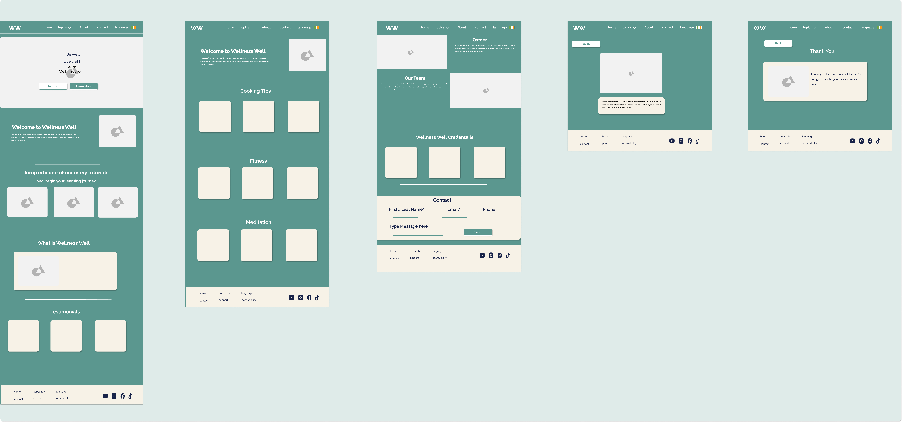

# Wellness Well

Wellness Well is a website that provides wellness tips and resources to support a healthy and fulfilling lifestyle. Whether you're looking for meditation techniques, fitness tips, healthy recipes, or mental well-being strategies, Wellness Well has got you covered.

## Table of Contents

- [About](#about) -[Project Background](#Project-Background)
- [Features](#features)
- [User Experience](#User-Experience)
  --[Desgin](#Desgin)
  --[Site Structure](#Site-Structure)
  --[Personas](#Personasa)
  --[Features](#Features)

- [Getting Started](#getting-started)
- [Usage](#usage)
- [Contributing](#contributing)
- [License](#license)
- [Technology Used](#Technology-Used)
-

## About

Wellness Well is a comprehensive wellness platform that aims to help individuals live their best lives. It offers a wealth of information, tutorials, and resources related to wellness, including meditation, fitness, nutrition, and mental well-being.

The website features an intuitive and user-friendly interface, making it easy for visitors to navigate through different sections and access the content they are interested in. It also provides a responsive design, ensuring a seamless experience across various devices.

## Project Background

The project aims to develop a responsive website for a photography portfolio. The purpose of the website is to showcase the photographer's work and attract potential clients. The motivation behind this project is to provide a visually appealing platform that effectively highlights the photographer's skills and talent.

The website will address the challenge of creating an immersive and engaging experience for visitors, allowing them to explore the photographer's portfolio and easily contact them for inquiries or bookings. Throughout the development process, the focus will be on creating a user-friendly and visually stunning website that aligns with the photographer's brand identity.

##User Experience
The target audience for the website includes individuals and businesses seeking professional photography services. The user experience goals for the website are to provide a visually captivating and easy-to-navigate interface that effectively showcases the photographer's work.

To ensure a seamless user experience, the website will employ a user-centered design approach. This will involve conducting user research to understand the target audience's preferences and expectations. Usability testing will also be conducted to identify and address any potential usability issues.

The website will incorporate features such as a responsive design to ensure optimal viewing on different devices, a clear and intuitive navigation menu, and a portfolio section with visually appealing image galleries. These features aim to enhance the overall user experience and facilitate effortless exploration of the photographer's portfolio.

## Design

The design of the website will focus on creating a visually striking and cohesive aesthetic that complements. The color palette will consist of natiral muted tones to portray nature and relaxation. The typography will be clean and elegant, ensuring readability and visual consistency.

The website will adhere to design principles that prioritize accessibility and responsiveness. It will be optimized for various screen sizes and resolutions, ensuring a consistent and enjoyable experience across different devices. The use of appropriate contrast, alt text for images, and scalable layouts will contribute to an inclusive and accessible design.

## Site Structure

The website will consist of several main sections: Home, About, and Contact. The Home section will serve as the landing page, providing an introduction to Welness Well .

The About section will provide background information about the owner , including their experience, skills, and their approach.

To facilitate easy navigation, a clear and intuitive menu system will be implemented. The menu will be present on all pages, allowing users to access different sections of the website with ease. Additionally, interactive elements such as image sliders and hover effects will be incorporated to enhance the overall user experience and engagement.

Wellness Well also has a seperate pages for each Exercise. There are currently nine of these pages. A "Back" button allows the user to go back yto exactly where the were on the previou page allowing for intuitive navigation.

## Personas

Understanding the target audience: Personas help in gaining a deeper understanding of the different types of users who will interact with the website. By creating personas, you can identify their demographics, needs, goals, and pain points. This knowledge helps in tailoring the website's content, features, and design to better meet the needs of the target audience.

Guiding design and development decisions: Personas serve as a reference point throughout the design and development process. They provide a clear picture of the users' characteristics and preferences, allowing you to make informed decisions about the website's layout, navigation, visual elements, and functionality. By considering the personas, you can ensure that the website resonates with the intended users and provides a positive user experience.

Personalizing the user experience: Personas help in creating a personalized user experience for different segments of the target audience. By understanding the unique needs and motivations of each persona, you can tailor the content, recommendations, and user interactions to provide relevant and engaging experiences. This personalization enhances user satisfaction and increases the likelihood of users returning to the website.

Aligning marketing and communication strategies: Personas provide insights into how to effectively communicate and engage with the target audience. By understanding the personas' preferred communication channels, tone, and messaging, you can develop targeted marketing campaigns and strategies that resonate with the intended users. This alignment increases the chances of attracting and retaining the right users for the website.

Identifying opportunities for growth and improvement: Personas can uncover opportunities for growth and improvement by highlighting pain points and unmet needs of the target audience. By identifying gaps in the current offering, you can make informed decisions about adding new features, improving existing functionality, or expanding the content to better serve the users. This iterative approach ensures that the website remains relevant and valuable over time.

Overall, creating personas for Wellness Well enables a user-centered design approach, ensuring that the website meets the needs and expectations of its target audience. By considering the personas throughout the design and development process, you can create a website that provides a valuable and engaging experience for users seeking wellness tips and resources.
.png)

.pngl)

.png)

## Features

- **Mobile-Friendly:** The website is optimized for mobile devices, allowing users to access the content on the go.
- **Navigation Menu:** A navigation menu provides quick links to different sections of the website, including Home, Tutorials, About, and Contact.
- **Hamburger Menu:** For mobile devices, a hamburger menu is available, allowing users to toggle the mobile menu for easy navigation.
- **Banner and Call-to-Action:** A visually appealing banner welcomes visitors with a motivational message and provides call-to-action buttons to jump into tutorials or learn more about the website.
- **Tutorials:** The website offers a variety of tutorials on topics such as meditation, fitness, and cooking. Each tutorial is represented by a visually appealing card with a brief description.
- **Testimonials:** Testimonials from satisfied users are showcased, providing social proof of the website's effectiveness.
- **Footer:** The footer section contains links to different pages, social media profiles, and company information.

## Getting Started

To get started with Wellness Well, follow these steps:

1. Clone the repository: `git clone <repository-url>`
2. Open the project in a web development environment.
3. Launch the website by opening the `index.html` file in a web browser.

## Usage

Once you have the website up and running, you can explore the various sections and features:

- Navigate through the different pages using the navigation menu or the hamburger menu on mobile devices.
- Click on the tutorials to access detailed information and tips on meditation, fitness, and cooking.
- Read the testimonials to learn about the positive experiences of other users.
- Connect with Wellness Well on social media through the provided links in the footer.

## Technologies Used

The website utilizes the following technologies and tools:

HTML5: The website structure and content are built using HTML5, providing a semantic markup for improved accessibility and search engine optimization.

CSS3: CSS3 is used to style the website, including layout, typography, colors, and visual effects. It enables the creation of a visually appealing and responsive design.

Bootstrap: The Bootstrap framework is employed to enhance the website's responsiveness and facilitate the development of a mobile-first design approach. It provides a collection of pre-built CSS and JavaScript components, ensuring consistency and compatibility across different devices.

JavaScript: JavaScript is utilized to add interactivity and dynamic functionality to the website. It enables features such as image sliders, smooth scrolling, form validation, and menu navigation.

jQuery: jQuery, a fast and concise JavaScript library, is utilized to simplify and streamline common JavaScript tasks. It provides an efficient way to manipulate HTML elements, handle events, and make AJAX requests.

FontAwesome: FontAwesome icons are used to enhance the visual representation of elements throughout the website. These scalable vector icons offer a wide range of choices and can be easily customized.

Google Fonts: Google Fonts are employed to enhance the typography of the website. They provide a vast selection of free and easy-to-use fonts that can be embedded into web pages.

Git: Git version control system is utilized for code management and collaboration. It allows for tracking changes, branching, and merging, ensuring a smooth development workflow.

GitHub: GitHub is used as a remote repository to host and manage the project's source code. It provides a platform for version control, issue tracking, and collaboration among team members.

Visual Studio Code: Visual Studio Code is the chosen integrated development environment (IDE) for this project. It offers a rich set of features, including syntax highlighting, code completion, and debugging tools, to facilitate efficient code development

Dribble were the sources of all imagery/illustrations

The Code Institute modules/lessons aided my learning and many of the concepts learned were applied in this project

Wireframes and mockups were designed in Figma

YouTube was used to source all video content

## Contributing

Contributions to Wellness Well are welcome! If you have any suggestions, improvements, or bug fixes, please feel free to open an issue or submit a pull request.

## License

Wellness Well is open source and released under the [MIT License](LICENSE).

---

Images/Content
Yoga Exercise :

Meditation Exercise :

Cooking:

Fitness

Illustrations: Dribble
https://dribbble.com/shots/16295497-Avatars-for-HR-department/attachments/8172168?mode=media Creator:
https://dribbble.com/shots/15429676-Vegetarian-woman Creator: Ailey Daily  
https://dribbble.com/shots/19437410-It-s-Cooking-Time Creator: Unini
https://dribbble.com/shots/19795319-Cooking-Fruit-Cakes Creator: Shakuro Graphics
https://dribbble.com/shots/19707211-Keep-calm-flat-illustration Creator: Boyko
https://dribbble.com/shots/15468329-Mental-problem-Stressed-employee Creator: KSENIIA FAST
https://dribbble.com/shots/6157481-Picnic Creator: Cami
https://dribbble.com/shots/15689216-Yoga Creator: Felic Art
https://dribbble.com/shots/8719823-Young-man-meditating Creator: Kit8
https://dribbble.com/shots/19887561-Yoga Creator:Felic Illustration
https://dribbble.com/shots/19868059-Fitness Creator: Felic Illustration
https://dribbble.com/shots/20067747-Team-work Creator: Lana Marandina

Thank you for choosing Wellness Well! We hope you find the resources and information on our website helpful in your journey towards a healthier and more fulfilling lifestyle. If you have any questions or need further assistance, please don't hesitate to contact us.
